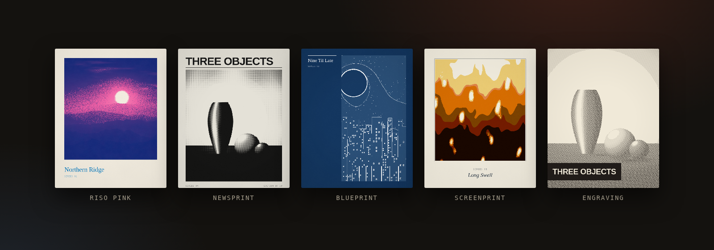
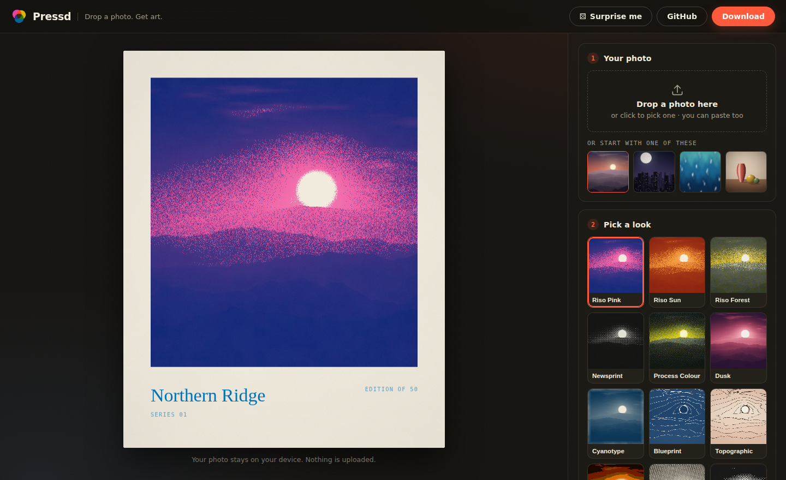

<div align="center">


# Pressd

**Drop a photo. Get art.**

Turn any picture into something that looks like it came off a printing press.
Risograph, halftone, screenprint, cyanotype. Free, no sign-up, and your photo
never leaves your computer.

### [→ Open Pressd](https://rootium.github.io/Placeholder/)



</div>

---

## What it does

You drop in a photo. Pressd shows you sixteen different print styles, all
rendered on *your* picture, side by side. You pick one, add a title if you feel
like it, and download a poster big enough to actually print and hang up.

That's it. No account, no watermark, no "upgrade to remove".



## Why it's not just a filter

Most photo apps paste a look on top of your picture. Pressd works out how much
of each ink covers each part of the image, then lays those inks down the way a
real press does — one colour at a time, slightly out of register, overprinting
where they overlap.

That's why two inks make a proper third colour instead of a muddy one, and why
the grain sits *in* the image instead of on top of it.

It also means everything scales. The 700-pixel preview on your screen and the
4000-pixel file you download are the same drawing, so what you see is what you
get.

## The looks

| | |
|---|---|
| **Riso Pink** | Two drums, slightly out of register |
| **Riso Sun** | Orange and burgundy on cream |
| **Riso Forest** | Green, teal and black, three passes |
| **Newsprint** | One black screen on cheap stock |
| **Process Colour** | Full CMYK rosette, like a magazine |
| **Dusk** | Smooth two-colour gradient, no screen |
| **Cyanotype** | Sun-printed on brushed emulsion |
| **Blueprint** | White lines burned onto blue |
| **Topographic** | Height lines, like a survey map |
| **Screenprint** | Flat blocks, pulled by hand |
| **Engraving** | Crosshatched by a very patient hand |
| **Ordered Dither** | Hard 8×8 grid, pure and mechanical |
| **Handheld** | Four shades of green, 1989 |
| **Diffusion** | Error-diffused, soft and cloudy |
| **Terminal** | Every pixel is a character |
| **Typewriter** | Struck onto a sheet of copy paper |

Six layouts (gallery, museum, Swiss, zine, editorial, full bleed) and six paper
sizes on top of that. Every ink colour is yours to change.

## Your photo stays yours

There is no server. There is no upload. There is no analytics script.

Pressd is a folder of files that runs entirely in your browser. Your picture
gets read into memory, drawn on, and thrown away when you close the tab. You can
turn off your wifi after the page loads and it keeps working.

## Using it

1. Drop a photo on the page. You can also paste one, or click to browse.
2. Pick one of the sixteen looks. They're all rendered on your own photo, so
   what you see is what you get.
3. Type a title if you want one. Skip it if you don't.
4. Hit **Download**.

Press **Surprise me** if you'd rather not think about it. It picks a random
style and layout, which is honestly how most of the good ones happen.

## Running it yourself

No build step, no dependencies, no npm install. It's plain HTML, CSS and
JavaScript modules.

```bash
git clone https://github.com/rootium/Placeholder.git
cd Placeholder
python3 -m http.server 8000
```

Then open <http://localhost:8000>. It needs a server rather than opening the
file directly, because ES modules won't load over `file://`.

### Deploying

`.github/workflows/pages.yml` publishes the whole folder on every push. There's
no build step — the site is the repository.

It deploys two ways, on purpose:

1. **A `gh-pages` branch.** The workflow force-pushes each commit there. A
   public repo that gains a `gh-pages` branch gets Pages switched on for it
   automatically, so this route needs nobody to open repository settings. This
   is the one currently serving the site.
2. **The Actions artifact.** The newer route, kept alongside. It can't start a
   Pages site from scratch — a workflow token isn't allowed to create one, and
   only a repo admin can flip *Settings → Pages → Source: GitHub Actions*. It's
   marked `continue-on-error`, so the run still goes green without it, and it
   takes over cleanly if that setting is ever switched on.

### What's in here

```
index.html            the page
css/style.css         all the styling
js/
  main.js             wiring between the controls and the canvas
  presets.js          the sixteen styles, with real ink colours
  state.js            settings, saved to localStorage
  render/
    core.js           colour maths, noise, auto-levels
    effects.js        the ten print engines
    paper.js          paper fibre, grain, torn edges
    layout.js         poster layouts and typesetting
    pipeline.js       one render, start to finish
tools/
  make-samples.mjs    draws the sample photos from scratch
  contact-sheet.html  every style on every sample, for eyeballing changes
  promo.html          builds the images in this README
```

The sample photos aren't stock. They're drawn with maths by
`tools/make-samples.mjs`, which also contains a small PNG encoder, because Node
ships zlib and that turned out to be enough.

## How it actually works

Roughly, one render goes like this:

1. **Lay the paper.** Fill the sheet with a base colour, then add fibre and
   slow cloudy mottling.
2. **Work out the artwork rectangle** from the layout and paper size.
3. **Auto-level the photo.** Most snapshots don't use the full tonal range, and
   an ink engine only has the range it's given. Skip this and dark photos come
   out as black rectangles.
4. **Separate the inks.** Either by tone (stack the inks light to dark) or by
   colour (a real subtractive separation with grey component replacement, the
   same trick printers use to stop the colours fighting over the shadows).
5. **Screen it.** Dots, stochastic grain, crosshatch, dither — whatever the
   style calls for.
6. **Overprint.** Multiply the inks together onto the paper.
7. **Set the type, then grain the whole sheet.**

`js/render/effects.js` is where the interesting part lives.

## Roadmap

Things I'd like to add next, roughly in order:

- A print-on-demand button, so you can have the poster mailed to you framed
- Duotone from an uploaded palette
- Batch mode: one photo, every style, as a zip
- Custom fonts for the title
- A proper share card for social posts

See [docs/PLAN.md](docs/PLAN.md) for the full build and launch plan, and
[docs/IDEAS.md](docs/IDEAS.md) for the forty ideas this one beat.

## Contributing

Bug reports and new print styles are both very welcome. A style is just an entry
in `js/presets.js` — pick an engine, pick ink colours, tune the numbers. Open
`tools/contact-sheet.html` to see it against every sample at once.

## Licence

MIT. Do what you like with it, including selling what you make.

The posters you create are yours. There's no licence on your own output because
there's no server that ever saw it.
